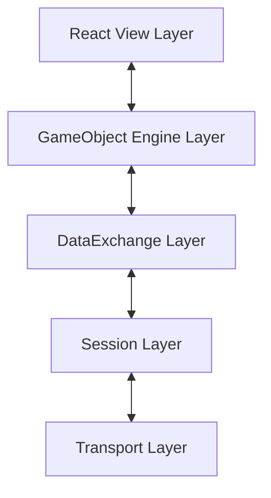

# Multiplayr

Multiplayr is a lightweight, reactive platform for creating multiplayer games where mobile devices (smartphones, tablets) act as game controllers/screens and a host device drives the central game loop. The game rules are defined in a data-driven, declarative (reactive) fashion.

In every game room, there is a single **Host** device and multiple **Client** devices. Both host and clients load the same game rule definitions, which consist of **data**, **methods**, and **views**. 

> [!IMPORTANT]
> **Single Source of Truth**: Only the Host has read/write access to the game state. The host automatically reconciles the game state and pushes the appropriate views and properties down to the clients. When clients want to mutate state, they call reactive remote methods that are transparently routed to and executed on the host.

---

## Building & Running

Get your local environment up and running:

### Local Development
```bash
# Install dependencies
npm install

# Build dev bundle
npm run buildDev

# Start server
npm start
```

### Production Build
```bash
npm run build
npm start
```

### Serverless Static P2P Build
Multiplayr can be compiled into a standalone static package utilizing WebRTC Peer-to-Peer transport (via PeerJS). This completely eliminates server-side dependencies and allows hosting the platform for free on static hosting sites (like GitHub Pages, Netlify, or Vercel).

To build the static package:
```bash
# Compile and output clean P2P client assets to /dist
npm run buildStatic
```
The compiled `/dist` directory contains a minimal Piet Mondrian-inspired `index.html` landing page, WebRTC host/join pages, statically bundled rule engines, and copied asset files. You can host this folder directly on any vanilla web server, or run it locally:
```bash
# Serve dist locally with http-server
npx http-server ./dist
```

### Running Automated Tests
Multiplayr comes with an extensive suite of automated tests verifying game logic and abstractions:
```bash
npm test
```

---

## High-Level Architecture

The Multiplayr engine is built upon a layered network protocol. Each layer populates a specific segment of a message packet and passes it down to the next:



### Core Layers Breakdown

| Layer | Responsibility |
| :--- | :--- |
| **View Layer (React)** | Renders the visual components. Interacts with the `mp` object via `this.props.MP` to invoke game methods. |
| **GameObject Engine** | Manages game rules, holds local global/player data stores, handles namespace nesting, and manages the execution/tick loop on data changes. |
| **DataExchange (DXC)** | Acts as the remote protocol intermediate layer. Allows clients to execute methods on the host (`execMethod`) and allows the host to push views to clients (`setView`). |
| **Session Layer** | Manages room-related protocols, room creation, client-joining, disconnections, client IDs, and message routing. |
| **Transport Layer** | Encapsulates the physical transport mechanism. Multiplayr implements Socket.io for network play and an in-memory `LocalClientTransport` for lightning-fast headless tests. |

---

## Declaring Game Rules

A game rule implements the `GameRuleInterface` and is declared as a reactive object. 

```typescript
export interface GameRuleInterface {
    name: string;
    plugins: { [gameName: string]: GameRuleInterface };
    globalData: { [varName: string]: any };
    playerData: { [varName: string]: any };
    onDataChange(mp: MPType, rule?: GameRuleInterface): boolean;
    methods: { [methodName: string]: (mp: any, clientId: string, ...args: any[]) => any };
    views: { [viewName: string]: any };
}
```

### Core Schema Definition

*   **`name`** (`string`): The unique namespace identifier of the game rule/plugin.
*   **`plugins`** (`Record<string, GameRuleInterface>`): Nested sub-rules/plugins that this rule composes.
*   **`globalData`** (`Record<string, any>`): Declares global state variables and their initial values/generators.
*   **`playerData`** (`Record<string, any>`): Declares player-specific variables instantiated for each connected client.
*   **`onDataChange`** `(mp: MPType) => boolean`: The core reactive reconciliation loop running exclusively on the host whenever data store variables change. Returning `true` instructs the engine to push and render updated views.
*   **`methods`** (`Record<string, Function>`): The list of operations available to be called by views. Run exclusively on the Host.
*   **`views`** (`Record<string, ReactComponent>`): The set of React/TSX components used to render the screens.

---

## Developer Deep-Dives & Agent Guidelines

For exhaustive explanations, architecture flowcharts, design guidelines, and testing patterns, please refer to the following documentation in the `./docs` directory:

1. [**Multiplayr Developer Guide & Agent Guidelines**](file:///c:/repos/multiplayr/docs/DEVELOPER_GUIDE.md)
   - **Action-Reconciliation Lifecycle**: Uni-directional client-server action flow.
   - **Plugin Chaining & Namespaces**: Composability of features (`lobby`, `gameshell`).
   - **The GameState/View/Method Pattern**: Decoupled game engines.
   - **Mandatory Testing Methodologies**: Class-level unit tests and integration tests via `GameRuleTest`.
2. [**Multiplayr Design Language & Style Guide**](file:///c:/repos/multiplayr/docs/DESIGN_GUIDE.md)
   - **Neo-Brutalist Aesthetic**: Outlined elements and solid offset shadows (`box-shadow: 4px 4px 0px #000;`).
   - **Multi-Device Responsiveness**: Supporting portrait/landscape orientations, proper touch target sizes (min `44px`), and viewport-height layout constraints.
   - **UI Tabs**: Leveraging the Game Shell navigation menu to organize interfaces cleanly.
   - **Event Broadcasts**: Toast notifications and sound feedback via `gameshell`.
   - **Emoji Rules**: Restricting emojis to functional text-replacement iconography only.

> [!IMPORTANT]
> **Instructions for AI Agents**: Before modifying any existing code, creating new games, or editing styles in this repository, you **MUST** read and strictly adhere to both the Developer Guide and the Design & Style Language Guide to maintain architectural consistency and structural quality.
