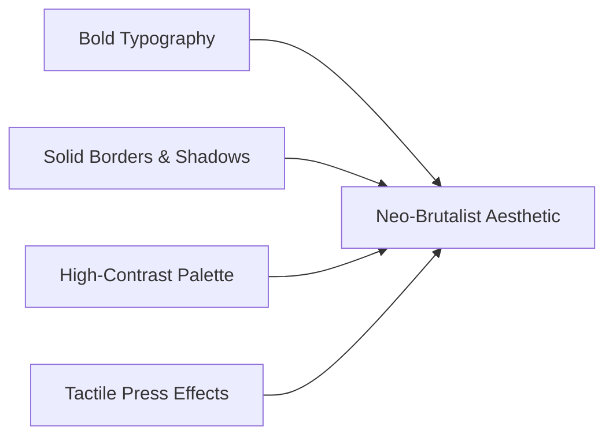
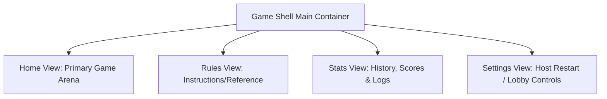

# Multiplayr Design Language & Style Guide

This guide defines the standard design language, color systems, layout structures, and interactive patterns for creating visually stunning and highly polished games on the Multiplayr platform.

Whether you are styling a board, laying out a card hand, or setting up a dashboard, this guide ensures your game matches the premium, high-contrast, tactile aesthetic established by some existing games in Multiplayr.

---

## 1. Aesthetic Philosophy: Neo-Brutalist Tabletop

Multiplayr games should feel like high-quality physical board games on your screen. The primary aesthetic theme is **Neo-Brutalist Tabletop**, characterized by:
- **High Contrast**: Pure white or bright neon surfaces surrounded by heavy black borders.
- **Flat 3D Depth**: Real depth simulated using hard, offset solid box shadows instead of soft, blurry CSS dropshadows.
- **Tactile Interactions**: Buttons and cards that physically "sink" when clicked or hovered.
- **Clean Grid Layouts**: Structured, grid-based card zones and dashboard metrics that look orderly and legible.



---

## 2. Color Schemes & Palettes

To build harmonious interfaces, avoid default browser primary colors. Utilize curated, saturated color schemes with high contrast.

### 2.1 Standard Palette
- **Base Background**: `#fbfbfb` (off-white) or `#f8f9fa` (light grey).
- **Core Contrast/Lines**: `#000000` (deep solid black).
- **Subtle Backdrops**: `#ffffff` (pure white) for card backgrounds and container boxes.
- **Neutral Accent**: `#eee` or `#f2f2f2` for locked or disabled states.

### 2.2 Functional Accents
Use vibrant, flat colors for actions and statuses:
- **Success / Lock / Safe**: `#2ecc71` or `#48b975` (vibrant emerald green).
- **Warning / Warning Turn**: `#f1c40f` or `#f5c342` (warm yellow).
- **Danger / Penalty / Out-of-Order**: `#e74c3c` or `#d5482f` (warning red).
- **Active User / Blue Accent**: `#3498db` or `#457fc4` (flat blue).

> [!TIP]
> Always overlay dark text on bright accent backgrounds to maintain readability and high accessibility.

---

## 3. Typography & Text Styling

Your font choices should feel modern, clean, and distinct.
- **Mandatory Fonts**: Always prioritize loading modern sans-serif typefaces like `'Outfit'` or `'Inter'`.
  ```scss
  font-family: 'Outfit', 'Inter', sans-serif;
  ```
- **Title Headers (`h1`, `h2`, `h3`)**:
  - Force uppercase (`text-transform: uppercase`).
  - Increase letter spacing (`letter-spacing: 1px` or `2px`).
  - Add heavy bottom borders to separate headers from content:
    ```scss
    border-bottom: 4px solid #000;
    padding-bottom: 8px;
    margin-bottom: 15px;
    ```

---

## 4. Solid Borders & Solid Shadows

This is the signature design feature of the Multiplayr interface. 

### 4.1 Thick Outlines
Every card, zone, button, and header container must have a solid black outline:
- **Card hands / Small items**: `border: 2px solid #000;`
- **Main boards / Header bars / Large buttons**: `border: 4px solid #000;`

### 4.2 Flat Offset Shadows
NEVER use blurry dropshadows (e.g. `box-shadow: 0 4px 8px rgba(0,0,0,0.1)`). Instead, use flat, solid offset black shadows to simulate physical height:
```scss
/* Standard flat shadow */
box-shadow: 4px 4px 0px #000;

/* Heavy flat shadow for panels and rule zones */
box-shadow: 6px 6px 0px #000;
```

### 4.3 Tactile Hover & Click States
Make interactive elements react mechanically to cursor hovers and clicks by combining offsets and transitions:

```scss
.interactive-card {
    border: 4px solid #000;
    background: #ffffff;
    box-shadow: 6px 6px 0px #000;
    transition: transform 0.2s, box-shadow 0.2s;

    // Hover: Item rises up, shadow gets larger
    &:hover {
        transform: translate(-2px, -2px);
        box-shadow: 8px 8px 0px #000;
    }

    // Active click: Item is pushed flat against the shadow surface
    &:active {
        transform: translate(2px, 2px);
        box-shadow: 2px 2px 0px #000;
    }
}
```

---

## 5. UI Layout Organization using Game Shell Tabs

Fitting all game boards, rules, player sheets, and histories onto a single mobile viewport causes visual clutter. Leverage the `gameshell`'s built-in **tab-switching navigation** to distribute features logically and reduce cognitive load.

The game shell maps tabs based on keys defined in the `links` object.



### 5.1 Standard Tab Structure Template
Developers should structure game navigation using the following keys:
- **`'home'`**: The primary gaming arena (drawing decks, active board, player hands).
- **`'rules'`**: A static or interactive overlay component explaining core rules (e.g., `StartupsGameRules` or `ItoGameRules`).
- **`'stats'` or `'history'`**: An overview showing logs, score sheets, or player statistics.
- **`'settings'`** (Host only): Admin options such as restarting the game or returning to the lobby.

### 5.2 Implementation Example
In your game rule's main page React view:

```typescript
export class MyGameMainPage extends React.Component<ViewPropsInterface & MyProps, {}> {
    public render() {
        const mp = this.props.MP;

        const links = {
            'home': {
                'icon': 'gamepad',
                'label': 'Arena',
                'view': <MyGameArenaView {...this.props} />
            },
            'rules': {
                'icon': 'book',
                'label': 'Rules',
                'view': <MyGameRulesView />
            }
        };

        if (this.props.isHost) {
            links['settings'] = {
                'icon': 'cogs',
                'label': 'Settings',
                'view': (
                    <div className="settings-panel">
                        <button onClick={() => mp.restartGame()}>Restart Game</button>
                        <button onClick={() => mp.backToLobby()}>Back to Lobby</button>
                    </div>
                )
            };
        }

        return mp.getPluginView(
            'gameshell',
            'HostShell-Main',
            {
                'links': links,
                'gameName': 'Round ' + (this.props.round + 1),
                'topBarContent': `🪙 x${this.props.coins}`
            }
        );
    }
}
```

---

## 6. Action Feedback: Toast Notifications & Sound Cues

To keep players fully engaged, games must communicate significant actions taken by opponent players (e.g. discards, bids, locks, or penalties). 

Instead of implementing custom HTML elements or sound player modules, games should pass a `toastNotification` parameter to the `gameshell` plugin in `setViewProps` or the view render.

### 6.1 The Toast Notification Pattern
Pass a structured `toastNotification` object inside the `gameshell`'s view props:
```typescript
const toastNotification = {
    id: lastMove.moveId,       // A unique identifier (e.g., move ID or index)
    message: "Alice discarded a card from the market",
    bgColor: playerAccentColor, // Match background to acting player's lobby color
    sound: PassSound,          // Asset reference to MP3/WAV file
    duration: 5000             // Optional visibility timer (default: 3000ms)
};
```

### 6.2 Host Page Orchestration
In your game rule definition's `onDataChange` tick, construct the toast representation from the state's `lastMove` data and set it:

```typescript
// Inside onDataChange in mygame.tsx
const lastMove = gameState.get_last_move();

if (lastMove) {
    const idx = clientIds.indexOf(lastMove.playerId);
    const playerName = names[idx] || lastMove.playerId;
    const playerAccent = accents[idx] || '#2c3e50';

    const text = `${playerName} played ${lastMove.cardName}`;
    const soundToPlay = (lastMove.playerId === mp.hostId) ? SpecialSound : StandardSound;

    mp.playersForEach((clientId) => {
        mp.setViewProps(clientId, 'toastNotification', {
            id: lastMove.moveId,
            message: text,
            bgColor: playerAccent,
            sound: soundToPlay,
            duration: 4000
        });
    });
}
```

> [!IMPORTANT]
> The `id` field of `toastNotification` must update with every new event. The `gameshell` uses this ID to detect new notifications, trigger fading transitions, and replay sound assets.

### 6.3 Sound Selection Best Practices
- **Turn Cues**: Play distinct sounds when a player's turn starts (especially on mobile viewports where players might look away).
- **Positive Actions**: Use light, high-frequency sounds (e.g. coin collection chimes, deal sounds) for scoring, correct guesses, or draws.
- **Failures / Penalties**: Use heavy, low-frequency sounds (e.g. buzzer, alarm) when a player makes an out-of-order move, loses a life, or incurs debt.

---

## 7. Guidelines for Emoji Usage

To preserve the clean, professional, and tactile tabletop feel of Multiplayr games, developers must avoid the clutter of superfluous emojis.

> [!WARNING]
> Emojis are permitted **only as iconography that replaces text**. They must **never** be used as decorative embellishments beside text.

- **Bad (Superfluous/Decorative)**:
  - `<h2>🎉 Victory! 🎉</h2>` (Decorative emoji beside header)
  - `<p>💔 Game Over</p>` (Decorative emoji beside message text)
  - `<button>📢 Broadcast Move</button>` (Decorative emoji inside text buttons)
- **Good (Functional/Replacement)**:
  - `<span>❤️ x3</span>` or `<span>❤️3</span>` (The heart emoji replaces the word "lives")
  - `<span>🪙 x5</span>` (The coin emoji replaces the word "gold" or "coins")
  - `<span>🏆</span>` (Used standalone inside a leaderboard badge to signify first place)

---

## 8. Multi-Device Responsiveness & Touch Controls

Since Multiplayr is played on personal client devices (e.g. mobile phones, tablets, laptops), the UI must be designed to adapt cleanly across diverse displays and input interfaces.

### 8.1 Desktop and Mobile Orientation Support
All game UIs must be functional and fully optimized for:
- **Desktop Browsers** (Wide viewports with landscape-locked layout).
- **Mobile Browsers (Portrait)**: The standard layout for pass-and-play or individual client views.
- **Mobile Browsers (Landscape)**: Supported dynamically when clients rotate their device.

### 8.2 Input Adaptation (Mouse vs. Touch)
- **Touch Targets**: Ensure buttons, selector cards, and navigation links have a minimum target size of `44px x 44px` with sufficient margins. This avoids accidental misclicks on small touchscreens.
- **Hover Dependency**: Never hide vital actions or data behind mouse hover effects. While desktop mouse hovers are great for micro-animations (like card-raising offsets), touch inputs do not have hovers. All gameplay actions must be fully visible and accessible via a single tap.

### 8.3 Screen Density and Scrolling Rules
- **Viewport Fit**: Design client views to fit within the viewport height (`100vh`) without requiring extensive vertical or horizontal scrolling.
- **Compact Layouts**: On small mobile devices, condense margins, reduce padding, and dynamically scale card sizes (e.g. using CSS grid or flexbox with dynamic units).
- **Tabbed Segregation**: Move non-essential metrics (like historical logs or full rules) into secondary Game Shell tabs (`links`) so the home page remains compact and focuses entirely on active player controls.
