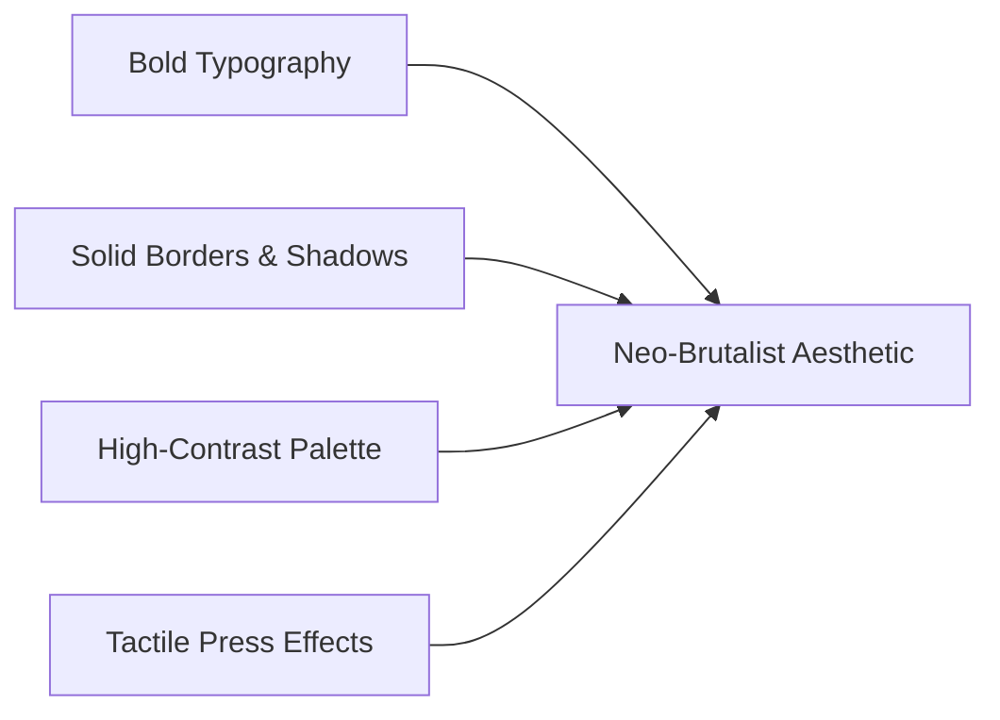
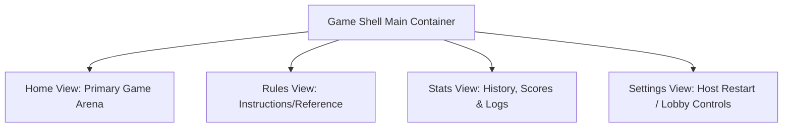

# Multiplayr Design Language & Style Guide

This guide defines the standard design language, color systems, layout structures, and interactive patterns for creating visually stunning and highly polished games on the Multiplayr platform.

Whether you are styling a board, laying out a card hand, or setting up a dashboard, this guide ensures your game matches the premium, high-contrast, tactile aesthetic established by some existing games in Multiplayr.

---

## 1. Aesthetic Philosophy: Neo-Brutalist Tabletop

Multiplayr games should feel like high-quality physical board games on your screen. The primary aesthetic theme is **Neo-Brutalist Tabletop**, characterized by:
- **High Contrast**: Pure white or bright neon surfaces surrounded by heavy black borders.
- **Flat 3D Depth**: Real depth simulated using hard, offset solid box shadows instead of soft, blurry CSS dropshadows.
- **Tactile Interactions**: Buttons and cards that physically "sink" when clicked or hovered.
- **Clean Grid Layouts**: Structured, grid-based card zones and dashboard metrics that look orderly and legible.


```mermaid
flowchart LR
    Sub1[Bold Typography] --> Theme[Neo-Brutalist Aesthetic]
    Sub2[Solid Borders & Shadows] --> Theme
    Sub3[High-Contrast Palette] --> Theme
    Sub4[Tactile Press Effects] --> Theme
```

---

## 2. Color Schemes & Palettes

To build harmonious interfaces, avoid default browser primary colors. Utilize curated, saturated color schemes with high contrast.

### 2.1 Standard Palette
- **Base Background**: `#fbfbfb` (off-white) or `#f8f9fa` (light grey).
- **Core Contrast/Lines**: `#000000` (deep solid black).
- **Subtle Backdrops**: `#ffffff` (pure white) for card backgrounds and container boxes.
- **Neutral Accent**: `#eee` or `#f2f2f2` for locked or disabled states.

### 2.2 Functional Accents
Use vibrant, flat colors for actions and statuses:
- **Success / Lock / Safe**: `#2ecc71` or `#48b975` (vibrant emerald green).
- **Warning / Warning Turn**: `#f1c40f` or `#f5c342` (warm yellow).
- **Danger / Penalty / Out-of-Order**: `#e74c3c` or `#d5482f` (warning red).
- **Active User / Blue Accent**: `#3498db` or `#457fc4` (flat blue).

> [!TIP]
> Always overlay dark text on bright accent backgrounds to maintain readability and high accessibility.

---

## 3. Typography & Text Styling

Your font choices should feel modern, clean, and distinct.
- **Mandatory Fonts**: Always prioritize loading modern sans-serif typefaces like `'Outfit'` or `'Inter'`.
  ```scss
  font-family: 'Outfit', 'Inter', sans-serif;
  ```
- **Title Headers (`h1`, `h2`, `h3`)**:
  - Force uppercase (`text-transform: uppercase`).
  - Increase letter spacing (`letter-spacing: 1px` or `2px`).
  - Add heavy bottom borders to separate headers from content:
    ```scss
    border-bottom: 4px solid #000;
    padding-bottom: 8px;
    margin-bottom: 15px;
    ```

---

## 4. Solid Borders & Solid Shadows

This is the signature design feature of the Multiplayr interface. 

### 4.1 Thick Outlines
Every card, zone, button, and header container must have a solid black outline:
- **Card hands / Small items**: `border: 2px solid #000;`
- **Main boards / Header bars / Large buttons**: `border: 4px solid #000;`

### 4.2 Flat Offset Shadows
NEVER use blurry dropshadows (e.g. `box-shadow: 0 4px 8px rgba(0,0,0,0.1)`). Instead, use flat, solid offset black shadows to simulate physical height:
```scss
/* Standard flat shadow */
box-shadow: 4px 4px 0px #000;

/* Heavy flat shadow for panels and rule zones */
box-shadow: 6px 6px 0px #000;
```

### 4.3 Tactile Hover & Click States
Make interactive elements react mechanically to cursor hovers and clicks by combining offsets and transitions:

```scss
.interactive-card {
    border: 4px solid #000;
    background: #ffffff;
    box-shadow: 6px 6px 0px #000;
    transition: transform 0.2s, box-shadow 0.2s;

    // Hover: Item rises up, shadow gets larger
    &:hover {
        transform: translate(-2px, -2px);
        box-shadow: 8px 8px 0px #000;
    }

    // Active click: Item is pushed flat against the shadow surface
    &:active {
        transform: translate(2px, 2px);
        box-shadow: 2px 2px 0px #000;
    }
}
```

---

## 5. UI Layout Organization using Game Shell Tabs

Fitting all game boards, rules, player sheets, and histories onto a single mobile viewport causes visual clutter. Leverage the `gameshell`'s built-in **tab-switching navigation** to distribute features logically and reduce cognitive load.

The game shell maps tabs based on keys defined in the `links` object.


```mermaid
graph TD
    GS[Game Shell Main Container] --> HomeTab[Home View: Primary Game Arena]
    GS --> RulesTab[Rules View: Instructions/Reference]
    GS --> StatsTab[Stats View: History, Scores & Logs]
    GS --> SettingsTab[Settings View: Host Restart / Lobby Controls]
```

### 5.1 Standard Tab Structure Template
Developers should structure game navigation using the following keys:
- **`'home'`**: The primary gaming arena (drawing decks, active board, player hands).
- **`'rules'`**: A static or interactive overlay component explaining core rules (e.g., `StartupsGameRules` or `ItoGameRules`).
- **`'stats'` or `'history'`**: An overview showing logs, score sheets, or player statistics.
- **`'settings'`** (Host only): Admin options such as restarting the game or returning to the lobby.

### 5.2 Implementation Example
In your game rule's main page React view:

```typescript
export class MyGameMainPage extends React.Component<ViewPropsInterface & MyProps, {}> {
    public render() {
        const mp = this.props.MP;

        const links = {
            'home': {
                'icon': 'gamepad',
                'label': 'Arena',
                'view': <MyGameArenaView {...this.props} />
            },
            'rules': {
                'icon': 'book',
                'label': 'Rules',
                'view': <MyGameRulesView />
            }
        };

        if (this.props.isHost) {
            links['settings'] = {
                'icon': 'cogs',
                'label': 'Settings',
                'view': (
                    <div className="settings-panel">
                        <button onClick={() => mp.restartGame()}>Restart Game</button>
                        <button onClick={() => mp.backToLobby()}>Back to Lobby</button>
                    </div>
                )
            };
        }

        return mp.getPluginView(
            'gameshell',
            'HostShell-Main',
            {
                'links': links,
                'gameName': 'Round ' + (this.props.round + 1),
                'topBarContent': `🪙 x${this.props.coins}`
            }
        );
    }
}
```

### 5.3 Active Player Attention Indicator

To guide the active player when it is their turn to take action, games should highlight the gameshell's room tag in the top-right corner using an orange pulsing animation. This keeps players alert, speeds up round times, and provides instant visual feedback without cluttering the main board view.

**How to Implement**:
1. Check if the active client has something to do or if it is currently their turn:
   ```typescript
   const isMyTurn = this.props.gameStatus === GameStatus.Active && mp.clientId === this.props.currentPlayerId;
   ```
2. Pass the `'attention-bg'` CSS class to the `'roomClassName'` property inside the gameshell plugin's options:
   ```typescript
   return mp.getPluginView(
       'gameshell',
       'HostShell-Main',
       {
           'links': links,
           'gameName': 'MyGame',
           'topBarContent': `Score: ${this.props.score}`,
           'roomClassName': isMyTurn ? 'attention-bg' : ''
       }
   );
   ```
3. The gameshell's global stylesheet will automatically handle the pulsing orange background and text animations.

---

## 6. Action Feedback: Toast Notifications & Sound Cues

To keep players fully engaged, games must communicate significant actions taken by opponent players (e.g. discards, bids, locks, or penalties). 

Instead of implementing custom HTML elements or sound player modules, games should pass a `toastNotification` parameter to the `gameshell` plugin in `setViewProps` or the view render.

### 6.1 The Toast Notification Pattern
Pass a structured `toastNotification` object inside the `gameshell`'s view props:
```typescript
const toastNotification = {
    id: lastMove.moveId,       // A unique identifier (e.g., move ID or index)
    message: "Alice discarded a card from the market",
    bgColor: playerAccentColor, // Match background to acting player's lobby color
    sound: PassSound,          // Asset reference to MP3/WAV file
    duration: 5000             // Optional visibility timer (default: 3000ms)
};
```

### 6.2 Host Page Orchestration
In your game rule definition's `onDataChange` tick, construct the toast representation from the state's `lastMove` data and set it:

```typescript
// Inside onDataChange in mygame.tsx
const lastMove = gameState.get_last_move();

if (lastMove) {
    const idx = clientIds.indexOf(lastMove.playerId);
    const playerName = names[idx] || lastMove.playerId;
    const playerAccent = accents[idx] || '#2c3e50';

    const text = `${playerName} played ${lastMove.cardName}`;
    const soundToPlay = (lastMove.playerId === mp.hostId) ? SpecialSound : StandardSound;

    mp.playersForEach((clientId) => {
        mp.setViewProps(clientId, 'toastNotification', {
            id: lastMove.moveId,
            message: text,
            bgColor: playerAccent,
            sound: soundToPlay,
            duration: 4000
        });
    });
}
```

> [!IMPORTANT]
> The `id` field of `toastNotification` must update with every new event. The `gameshell` uses this ID to detect new notifications, trigger fading transitions, and replay sound assets.

### 6.3 Sound Selection Best Practices
- **Turn Cues**: Play distinct sounds when a player's turn starts (especially on mobile viewports where players might look away).
- **Positive Actions**: Use light, high-frequency sounds (e.g. coin collection chimes, deal sounds) for scoring, correct guesses, or draws.
- **Failures / Penalties**: Use heavy, low-frequency sounds (e.g. buzzer, alarm) when a player makes an out-of-order move, loses a life, or incurs debt.

---

## 7. Guidelines for Emoji Usage

To preserve the clean, professional, and tactile tabletop feel of Multiplayr games, developers must avoid the clutter of superfluous emojis.

> [!WARNING]
> Emojis are permitted **only as iconography that replaces text**. They must **never** be used as decorative embellishments beside text.

- **Bad (Superfluous/Decorative)**:
  - `<h2>🎉 Victory! 🎉</h2>` (Decorative emoji beside header)
  - `<p>💔 Game Over</p>` (Decorative emoji beside message text)
  - `<button>📢 Broadcast Move</button>` (Decorative emoji inside text buttons)
- **Good (Functional/Replacement)**:
  - `<span>❤️ x3</span>` or `<span>❤️3</span>` (The heart emoji replaces the word "lives")
  - `<span>🪙 x5</span>` (The coin emoji replaces the word "gold" or "coins")
  - `<span>🏆</span>` (Used standalone inside a leaderboard badge to signify first place)

---

## 8. Multi-Device Responsiveness & Touch Controls

Since Multiplayr is played on personal client devices (e.g. mobile phones, tablets, laptops), the UI must be designed to adapt cleanly across diverse displays and input interfaces.

### 8.1 Desktop and Mobile Orientation Support
All game UIs must be functional and fully optimized for:
- **Desktop Browsers** (Wide viewports with landscape-locked layout).
- **Mobile Browsers (Portrait)**: The standard layout for pass-and-play or individual client views.
- **Mobile Browsers (Landscape)**: Supported dynamically when clients rotate their device.

### 8.2 Input Adaptation (Mouse vs. Touch)
- **Touch Targets**: Ensure buttons, selector cards, and navigation links have a minimum target size of `44px x 44px` with sufficient margins. This avoids accidental misclicks on small touchscreens.
- **Hover Dependency**: Never hide vital actions or data behind mouse hover effects. While desktop mouse hovers are great for micro-animations (like card-raising offsets), touch inputs do not have hovers. All gameplay actions must be fully visible and accessible via a single tap.

### 8.3 Screen Density and Scrolling Rules
- **Viewport Fit**: Design client views to fit within the viewport height (`100vh`) without requiring extensive vertical or horizontal scrolling.
- **Compact Layouts**: On small mobile devices, condense margins, reduce padding, and dynamically scale card sizes (e.g. using CSS grid or flexbox with dynamic units).
- **Tabbed Segregation**: Move non-essential metrics (like historical logs or full rules) into secondary Game Shell tabs (`links`) so the home page remains compact and focuses entirely on active player controls.

### 8.4 Robust Scroll Lists & Container-Based Wrapping
To ensure the user interface is completely robust across simulated environments (such as the side-by-side Multiplayr debug emulator or split-screen views) and actual mobile devices, developers must adhere to these CSS patterns:

- **Container-Aware Stacking**:
  Avoid using window-width media queries (e.g., `@media (max-width: 768px)`) to stack columns vertically. If a game is loaded inside an iframe or split-pane, the window is wide but the game container is narrow, leading to squished, unplayable columns. Instead, use a wrapping Flexbox layout with a minimum flex basis:
  ```scss
  .board-middle-row {
      display: flex;
      flex-wrap: wrap;
      gap: 15px;

      & > div {
          flex: 1 1 320px; // Wrap vertically once space is under ~640px
          min-width: 0;    // Allow the child columns to shrink inside grid contexts
      }
  }
  ```
- **Dynamic List Wrapping**:
  For grids containing uniform components (such as small badges or token stacks), use wrapping flex containers rather than hardcoded columns:
  ```scss
  .tokens-grid {
      display: flex;
      flex-wrap: wrap;
      gap: 8px;

      .token-stack-card {
          flex: 1 1 130px; // Wrap to 1 column on narrow spaces, stretch to 2 or 3 when space is wider
      }
  }
  ```
- **Prevent Boundary Clipping in Scroll lists**:
  Horizontal scroll containers (like card hands, herds, or market displays) must define vertical and horizontal padding (e.g., `padding: 12px 16px;`). This provides breathing room so that:
  1. The first and last items do not collide with container borders.
  2. Selected cards using `transform: translateY(...)` offsets or large `box-shadow` styles do not have their shadows/borders clipped by the container's scroll boundary.
- **Safe Center Alignment**:
  Never use a standard `justify-content: center` on horizontal scrolling containers. If the items overflow, centering clips the start (left side) of the list, rendering the first items permanently unreachable by scroll controls. Use `justify-content: safe center` to center items when space permits, while falling back to start alignment upon overflow.

---

## 9. Rendering Playing Cards using `card-renderer`

Multiplayr provides a dedicated, geometric minimalist playing card rendering library (`card-renderer`) to layout and render cards with high precision. For a detailed API reference and configuration schemas, see the comprehensive [card-renderer README.md](file:///c:/repos/multiplayr/src/client/lib/card-renderer/README.md). When utilizing this library, developers must adhere to the following guidelines:

### 9.1 Color Scheme Alignment
The card's `palette` configuration must align with the specific visual theme of the game being implemented. Avoid generic palettes if the game has a custom style guide; instead, pass a curated `Palette` object that reflects the exact color palette of the board game.

### 9.2 Flat Card Aesthetic (Borderless by Default)
By default, cards and their internal layout components (such as frames, cost grids, headers, and footers) should be **borderless** (i.e. `borderWidth: 0` on the card, and `showBorder: false` on overlays/components). This maintains a clean, modern, flat vector card design feel and prevents visual clutter. Outer borders should only be enabled under bespoke gameplay states (such as highlighting a selected card, indicating active cards, or showing draft status).

### 9.3 Standard Card Dimensions
To support high-density layouts and responsive scaling, cards on Multiplayr should by default be configured to a width of **`80px`** (e.g., `width="80px"` with `responsive={true}`). The `PlayingCard` component will automatically handle vector auto-scaling internally, scaling headers, footers, illustrations, and margins proportionally to fit this size perfectly without any text cropping or border distortion.

### 9.4 Self-Contained Card Styling & Interaction States
Games and rules should **NOT** try to apply additional styling, overrides, or layout containers to configure the card's borders, margins, shadows, or interaction states. 
* **Do not write custom CSS or SCSS overrides** to animate card hovers, active clicks, or selection outlines.
* Instead, leverage the native, built-in properties of the `<PlayingCard>` component:
  * Pass `hoverable={true}` to enable premium hover lifting translations and shadow elevations.
  * Pass `selectable={true}` to configure touch targets and pointer cursors.
  * Pass `selected={true}` to draw a perfectly color-coordinated selection outline and apply tactile pressed translations.
This ensures all playing cards behave consistently across the platform and prevents visual conflicts or layout breakage in different viewports.

> [!NOTE]
> The "no overrides" rule above is the default path for generic cards. When a game must **faithfully reproduce a specific real board game's card faces** (custom header bands, cost columns, bespoke gems, tier markers, medallions), you will legitimately need custom icons and scoped layout overrides. See **Section 10** for the required patterns, text-sizing rules, and the gotchas that will otherwise bite you. `SplendorDuel` (`src/rules/splendorduel/`) is the reference implementation.

---

## 10. Custom Card Layouts & Vector Iconography (Advanced)

When the default card path (Section 9.3–9.4) isn't enough — i.e. you are recreating a real game's cards, tokens, and player boards with a specific look — build on the three layers below. `SplendorDuel` is the worked example; these are the hard-won learnings from it.

### 10.1 The three layers of a custom card
1. **Palette + definition builder** (`<Game>Assets.ts`): pure functions returning `CardDefinition` objects — choose icon IDs, header/data/footer content, dimensions, palette.
2. **Custom icons** (`IconObject` map in the same file, passed via `customIcons={…}`): your geometric vector glyphs.
3. **Scoped layout overrides** (`<game>.scss`): CSS under a wrapper class you add on the card (`.jewel-card`, `.royal-card`, …). Never restyle `.playing-card-*` globally — always scope under the wrapper so other games are unaffected.

### 10.2 Vector iconography with the IconEngine
- An icon is a list of primitive layers drawn in a **0–100 viewBox**. Each primitive renders centered at the origin (`circle` r=25, `rectangle` 50×50, `triangle`, `arch`) and is then transformed by `x`/`y` (translate within 0–100), `scaleX`/`scaleY`, and `rotation`.
- A disc that fills a coin/token cell = `circle` at `x:50, y:50` with `scaleX/scaleY ≈ 1.9` (r ≈ 47.5, ~95% of the box).
- **Fills**: palette keys (`'primary'`, `'background'`, `'border'`, `'accent'`…) resolve against the card's palette and follow it; **literal hex** (`'#2f93c2'`) stays fixed regardless of palette. Use literals for brand gem colors that must never shift; use keys when the shape should follow the band/card color.
- `fill: 'none'` + `stroke` + `strokeWidth` draws rings/outlines.
- Complex outlines (e.g. a 5-point star) use `type: 'bezier'` with a `customPath` authored directly in 0–100 space, with the layer at `x:0, y:0, scale:1`.
- Boolean `subtract` exists but **nested booleans are fragile** (operand-consumption tracking). Prefer stacking solid shapes over boolean ops.

### 10.3 The "coin / negative-space" pattern (flat + legible)

> [!TIP]
> This pattern is now built into the library: use `coinIcon(id, discColor, glyphLayers)` from `card-renderer/presets.ts` instead of hand-assembling the disc. Common glyphs (`star`, `crown`, `lock`, `scroll`) also ship in `PRESET_ICONS` — don't redraw them per game.

The most reusable idea: a **solid colored disc with the glyph knocked out**. Render the *same glyph geometry* three ways to keep a game visually unified:
- **Coin** (card costs, board tokens, panel counts): colored disc + glyph in **white** (or `'background'`) → on a white card the glyph reads as a punched hole. Bold and legible.
- **On-band bonus** (header over a colored band): **white disc** + glyph filled `'primary'` (the band color) → the band shows through the glyph.
- **Watermark** (decoration only): faint disc (`opacity ≈ 0.2`) + white glyph. **Never** use this for information the player must read — white-on-light is nearly invisible. (This was the royal-card bug: the ability art used the faint watermark and disappeared.)
- **Contrast beats habit**: a dark glyph on a mid/gold disc (`#4a3608` on `#d9a520`) reads far better than white-on-gold. Choose glyph color for contrast against its disc, not by reflex.

### 10.4 SVG sizing in regions — now guarded by the library
`ExpressiveIcon` renders an `<svg>` with **no intrinsic pixel size**. Historically, in a growable flex child (the default art region is `flex: 1`) the browser sized the flex item to the SVG's ~150px fallback and the card ballooned past its box (royal medallions once rendered ~2.5× oversized).

This is now fixed in the core: `.card-art-region` sets `min-height: 0; min-width: 0;` and the icon is clamped to `max-width/height: 100%`. **The default stacked layout is safe at any size — you no longer need per-game CSS just to avoid this.**

You still absolutely-position regions when you want a **bespoke layout** (a coloured header band, a cost column pinned left, art pinned right), because the default is a simple vertical stack. To do that, scope overrides under a wrapper class exactly like `.jewel-card`/`.royal-card`:
```scss
.my-card {
  .playing-card-face.face-front { display: block !important; position: relative; padding: 0 !important; }
  .card-header-region { position: absolute; top: 0; left: 0; width: 100%; height: 2.7em; }
  .card-art-region    { position: absolute; top: 2.7em; bottom: 2.7em; left: .3em; right: .3em; overflow: hidden; }
  .card-footer-region { position: absolute; bottom: 0; left: 0; width: 100%; height: 2.7em; }
}
```
This clamps the art to a fixed box. **Never leave a custom-icon art region as a growable flex item.**

### 10.5 Text size & the em-compounding trap
- The card base font is roughly `1em ≈ widthMm * 0.052`, scaled by the pixel `width`. At `width="88px"`, `1em ≈ 4.6px` — small.
- **Region font-sizes compound.** The footer region renders at `0.9 * footer.size em`, and `.card-footer-text` is another `em` on top of that. A footer `size: 1.0` with `.card-footer-text { font-size: 0.92em }` ends up ≈ 0.83em of the card base — frequently illegible. Boost the definition's footer `size` (e.g. `1.3`), keep labels **short** (`PRIVILEGE`, not `TAKE PRIVILEGE`), and set `white-space: normal` so they wrap instead of clipping.
- **Minimum legibility**: keep primary numbers ≳ 1.5em and body labels effectively ≳ 1.1em of the card base. If text won't fit, enlarge the card slightly or shorten the text — never ship 4px labels.
- Let icons carry meaning: a clear medallion + a one-word label beats a cramped sentence.

### 10.6 Inline styles beat CSS — pick one source of truth
An inline `style={{ width, height }}` on an element **wins over any stylesheet rule**. If you size an icon span inline, your per-context `.scss` sizes are silently ignored. Choose one: either size icons via a class in SCSS (set **no** inline size), or size inline and don't fight it in CSS. (In SplendorDuel we moved all panel-icon sizing into SCSS by dropping the inline width/height.)

### 10.7 Pixel-scaled mode (`width="Npx"`)
- Adds `.is-pixel-scaled`, which **disables** the compact-mode container query (the one that hides header/data/footer under 150px). Your regions stay visible even on small cards.
- Rendered height comes from `heightMm/widthMm × width`; the `height` **prop is ignored**. Set card *shape* (portrait vs landscape) via `widthMm`/`heightMm`, set *size* via the `width` prop, and match the wrapper `<div>` CSS to the computed size.

### 10.8 Alignment & spacing
- Use the absolutely-positioned regions from 10.4 for pixel control: a fixed-`em` header band, a cost column pinned left, a watermark pinned right, a footer pinned bottom.
- A **bolder color accent = a taller header band** (as a proportion of the card). Keep dark title text legible on it.
- Tighten dense lists: small `gap`, row-height ≈ icon size, and hairline (or no) separators.
- Match placeholder/empty-slot sizes to the real card size so grids don't jump.
- **Encode tiers/variants** with icon variants + CSS level classes: e.g. `castle_1/2/3` (tower count = tier) plus `.level-N .card-header-region::after` for a per-tier skyline. **Connect sub-shapes** (towers overlapping the wall base) so nothing floats with random gaps.

### 10.9 Consistency across the whole game
Reuse **one** icon set everywhere — cards, board tokens, and player-panel counts should render the *same* coin icons and the *same* palette. In SplendorDuel the board cells and panel token counts render the exact `gem_${color}_coin` used on card costs, so shape and color are identical platform-wide. Replace emoji with these vector icons (emoji beside vector cards looked inconsistent).

### 10.10 Flat vs Neo-Brutalist — choose one skin per game
The platform default is Neo-Brutalist (Sections 1–4: black borders, hard offset shadows). A game reproducing a modern, flat/pastel board game may instead adopt a **Flat Minimalist skin** (SplendorDuel):
- Hairline borders (`1px` light) + soft radius (12–16px); **no** offset shadows.
- Flat fills; show selection with an **inset ring** (`box-shadow: inset 0 0 0 3px <accent>`) so there's no layout shift, and pulse without a hard black shadow.
- Light panels instead of black/velvet backdrops.

Apply the chosen skin **consistently** to cards, board, and player panels. Don't mix a flat board with brutalist panels — a half-converted UI looks broken (we had to unify them across several passes).

### 10.11 Verify at true rendered size
Card styling can't be trusted from code alone. Two fast loops:
- Add a **temporary** debugger webpack entry that imports the game's `.scss` and real card definitions, renders a gallery, and screenshot it (SplendorDuel used a throwaway `splendor.preview` entry, then removed it).
- Or just run the game.

Either way, verify at the **actual pixel size** — the em-compounding (10.5) and SVG-inflation (10.4) bugs only appear at true scale. Always run `tsc --noEmit` and compile the `.scss` (`sass <file>`) after asset/style edits; the webpack build fails on TS/lint/Sass errors.

