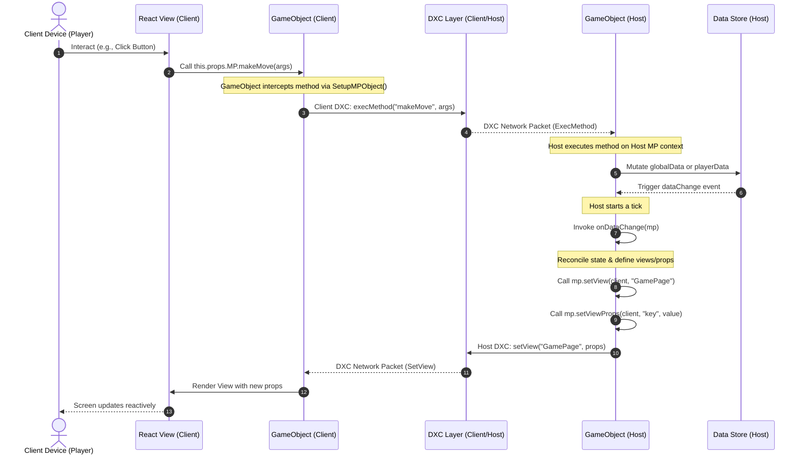

# Multiplayr Developer Guide & Agent Guidelines 📘

Welcome! This guide is designed to help human developers and AI agentic systems rapidly understand the architecture, core abstractions, composition patterns, and testing framework of Multiplayr. 

Whether you are debugging existing game loops or building brand-new games, these pages contain the precise diagrams and step-by-step code flows needed to work effectively in this repository.

---

## 🔄 1. The Action-Reconciliation Lifecycle

The most fundamental concept in Multiplayr is its **uni-directional, reactive data flow** across the client-server boundary. 

### Core Flow Sequence Diagram

This sequence diagram illustrates exactly what happens when a client performs an action (like playing a card or clicking a button):



### Flow Breakdown

1.  **View Binding**: All client-side React views receive the `mp` control object via `this.props.MP`.
2.  **Intercepted Method Remoting**: Methods declared on the game rule run *only* on the Host. On the client, the `SetupMPObject` wraps these functions in a remote procedure call wrapper (`clientMethodWrapper`). Invoking `this.props.MP.someMethod(...)` on a client automatically serializes the call and sends it over the DXC network layer to the Host.
3.  **Host Execution**: The Host receives the `ExecMethod` request, runs the registered method against the actual host `GameObject` state, and modifies the `DataStore`.
4.  **Host Tick & Reconciliation**: Modifying variables in the `DataStore` automatically schedules a "tick." During the tick, `onDataChange` is run on the Host.
5.  **View Distribution**: In `onDataChange`, the Host computes the appropriate views and props for each client ID, calling `mp.setView` and `mp.setViewProps`.
6.  **Push and Render**: These view configurations are pushed down over the DXC layer to the clients. The client-side engine receives the packet, passes the props into the React component, and reactively re-renders the DOM container.

---

## 🔗 2. Plugin Composition & Namespace Chaining

Multiplayr features a composition system where game rules can include plugins:
```typescript
export const BiggerRule: GameRuleInterface = {
    name: "bigger",
    plugins: {
        "lobby": LobbyPlugin
    },
    ...
}
```

### The Namespace Delimiter (`_`)

To prevent state collisions and enable modularity, all state variables and methods belonging to a plugin are dynamically namespaced using the underscore (`_`) delimiter. 
For instance, if rule `A` includes plugin `B`, and `B` includes plugin `C`:
- Variable `foo` in `B` is accessed from the parent rule `A` as: `mp.getData("B_foo")`
- Variable `bar` in `C` is accessed from the parent rule `A` as: `mp.getData("B_C_bar")`

### Recursive Namespace Routing

When you invoke a state access method (e.g. `getData`, `setData`, `getPlayerData`) or call a rule method on `mp`, the `GameObject` resolves the path recursively:

```typescript
function getFirstNamespace(variable: string) {
    const s = variable.split('_');
    if (s.length === 0) {
        return [null, variable];
    } else {
        const namespace = s[0];
        return [namespace, s.slice(1, s.length).join('_')];
    }
}
```

If the requested `variable` does not exist in the local `GameObject`'s store, the engine:
1. Splits the string by the first occurrence of `_` to isolate the `namespace` and the `rest`.
2. Inspects `this.plugins[namespace]`.
3. If it exists, delegates the call downwards: `this.plugins[namespace].getData(rest)`.

### View Props Delegation
When `onDataChange` finishes, the Host engine automatically nests the computed React props for all plugins and exposes them on the parent component's `props` object.
*   **Example**: If the `lobby` plugin calculates a list of names, the parent React view can access them directly via:
    ```javascript
    const playerNames = this.props.lobby.names;
    ```

---

## 🏗️ 3. Tutorial: Creating a Game from Scratch

Let's walk through implementing a simple game: **"Guess the Number"**.

### Step 1: Register the Rule
Add your game definition to [src/rules/rules.ts](file:///c:/repos/multiplayr/src/rules/rules.ts) so the server and client bundle loaders know it exists.

```typescript
import { GuessTheNumberRule } from './guessthenumber/guessthenumber';

export const MPRULES = {
    // ... other rules ...
    'guessthenumber': {
        description: 'A simple cooperative number guessing game!',
        rules: ['lobby', 'gameshell', 'guessthenumber'],
        rule: GuessTheNumberRule
    }
};
```

### Step 2: Implement the Game Logic
Create `src/rules/guessthenumber/guessthenumber.ts`. This file will hold your variables, game reconciliation loop, remote methods, and frontend screens:

```typescript
import * as React from 'react';
import { GameRuleInterface, MPType, ViewPropsInterface } from '../../common/interfaces';

export const GuessTheNumberRule: GameRuleInterface = {
    name: 'guessthenumber',

    // Compose with the standard Lobby and Shell plugins
    plugins: {},

    // Global variables (Only Host reads/writes)
    globalData: {
        targetNumber: () => Math.floor(Math.random() * 100) + 1,
        gameWon: false,
        attempts: 0
    },

    // Player-specific variables
    playerData: {
        lastGuess: null
    },

    // State Reconciliation Loop (Runs on Host when data changes)
    onDataChange: (mp: MPType) => {
        const gameWon = mp.getData('gameWon');
        const attempts = mp.getData('attempts');

        // Set props for all players
        mp.playersForEach((client) => {
            mp.setViewProps(client, 'attempts', attempts);
            mp.setViewProps(client, 'gameWon', gameWon);
            mp.setViewProps(client, 'lastGuess', mp.getPlayerData(client, 'lastGuess'));
            
            // Route views
            if (gameWon) {
                mp.setView(client, 'WinView');
            } else {
                mp.setView(client, 'PlayView');
            }
        });

        // Set Host dashboard view
        mp.setView(mp.hostId, 'HostDashboard');
        mp.setViewProps(mp.hostId, 'attempts', attempts);

        return true; // Return true to push and render updated views
    },

    // Remote Methods (Called from client views, executed on Host)
    methods: {
        submitGuess: (mp: MPType, clientId: string, guess: number) => {
            const target = mp.getData('targetNumber');
            const attempts = mp.getData('attempts');

            mp.setPlayerData(clientId, 'lastGuess', guess);
            mp.setData('attempts', attempts + 1);

            if (guess === target) {
                mp.setData('gameWon', true);
            }
        }
    },

    // UI View Components (React)
    views: {
        PlayView: class extends React.Component<ViewPropsInterface & { attempts: number, lastGuess: number }, { guessVal: string }> {
            state = { guessVal: '' };

            onSubmit = () => {
                const val = parseInt(this.state.guessVal);
                if (!isNaN(val)) {
                    // Call the remote host method
                    this.props.MP.submitGuess(val);
                }
            };

            render() {
                return (
                    <div className="guess-play-view">
                        <h2>Guess the Number!</h2>
                        <p>Attempts: {this.props.attempts}</p>
                        {this.props.lastGuess !== null && <p>Your last guess was: {this.props.lastGuess}</p>}
                        <input 
                            type="number" 
                            value={this.state.guessVal} 
                            onChange={(e) => this.setState({ guessVal: e.target.value })} 
                        />
                        <button onClick={this.onSubmit}>Submit Guess</button>
                    </div>
                );
            }
        },

        WinView: class extends React.Component<ViewPropsInterface & { attempts: number }, {}> {
            render() {
                return (
                    <div className="guess-win-view">
                        <h2>🎉 You Won!</h2>
                        <p>It took the team {this.props.attempts} attempts to find the correct number.</p>
                    </div>
                );
            }
        },

        HostDashboard: class extends React.Component<ViewPropsInterface & { attempts: number }, {}> {
            render() {
                return (
                    <div className="guess-host-view">
                        <h1>Game Dashboard</h1>
                        <p>The players have made {this.props.attempts} guesses.</p>
                    </div>
                );
            }
        }
    }
};
```

---

## 🤖 4. Automated Testing & AI Bots

Multiplayr provides a powerful framework for writing offline, high-speed simulations. The central class is `GameRuleTest`, which spins up a Host and multiple Client game objects in-memory using a lightweight loopback `LocalClientTransport`.

### The `MultiplayrAI` Bot Interface

To write automated bots, implement the `MultiplayrAI` interface:

```typescript
export interface MultiplayrAI {
    onPropsChange(props: ViewPropsInterface): void;
}
```

Whenever the Host updates the view state and pushes new props, the bot's `onPropsChange` method is triggered. The bot can inspect the properties and invoke actions via `props.MP`.

### Example Headless Simulation Test

Here is an example test file structure showing how to mock a player with a bot to verify game loops:

```typescript
import * as assert from 'assert';
import { GameRuleTest } from '../GameRuleTest';
import { MultiplayrAI, ViewPropsInterface } from '../../common/interfaces';

// Simple Bot Logic
class GuessingBot implements MultiplayrAI {
    public onPropsChange(props: ViewPropsInterface & { gameWon: boolean, lastGuess: number }) {
        if (props.gameWon) return; // Stop playing if won

        const previousGuess = props.lastGuess || 0;
        const nextGuess = previousGuess + 1;

        // Execute action remoted to host
        props.MP.submitGuess(nextGuess);
    }
}

describe('Guess The Number AI Simulation', () => {
    it('should successfully complete the game automatically', () => {
        // Spin up the rule engine with 1 player in-memory
        const gameTest = new GameRuleTest('guessthenumber', 1);
        const bot = new GuessingBot();

        // Bind bot to Player index 0
        gameTest.setAIPlayer(0, bot, {
            'submitGuess': (mp, original_method, guess) => {
                console.log(`Bot guessed: ${guess}`);
                original_method(guess); // Calls the real rule method
            }
        });

        // Set the initial game board state manually (forcing targetNumber = 5)
        const mockState = JSON.stringify({
            hostStore: {
                targetNumber: 5,
                gameWon: false,
                attempts: 0
            },
            clientsStore: {
                [gameTest.getPlayerClientId(0)]: {
                    lastGuess: null
                }
            },
            pluginsStore: {}
        });
        
        gameTest.setState(mockState); // Triggers initial bot reaction

        // Assertions: Verify game status
        assert.strictEqual(gameTest.getHostData('gameWon'), true);
        assert.strictEqual(gameTest.getHostData('attempts'), 5);
    });
});
```

---

## 🧭 5. Agent Guidelines

If you are an AI assistant tasked with modifying or extending Multiplayr, follow these strict coding guidelines to ensure perfect compatibility:

> [!WARNING]
> **Host-Only State Mutability**: NEVER attempt to store game state variables directly inside a React component's `this.state` or on the client-side `GameObject` instance. The Host is the *only* device that executes game methods and writes to the `DataStore`. Clients must remain entirely state-free and driven strictly by views and props pushed down by the Host.

*   **Plugin Prefix Safety**: When adding a new composed rule or plugin, verify that you are prefixing any plugin variables appropriately (e.g. `mp.setData('lobby_name', val)` instead of `mp.setData('name', val)`).
*   **Method Signatures**: All custom methods inside `methods` MUST have `mp: MPType` as their first parameter, and `clientId: string` as their second parameter:
    ```typescript
    methods: {
        myMethod: (mp: MPType, clientId: string, arg1: any) => { ... }
    }
    ```
*   **Run compile check**: After making changes, always run `npm run buildDev` and `npm test` to ensure that standard types compile correctly and that the automated test suite continues to pass.
