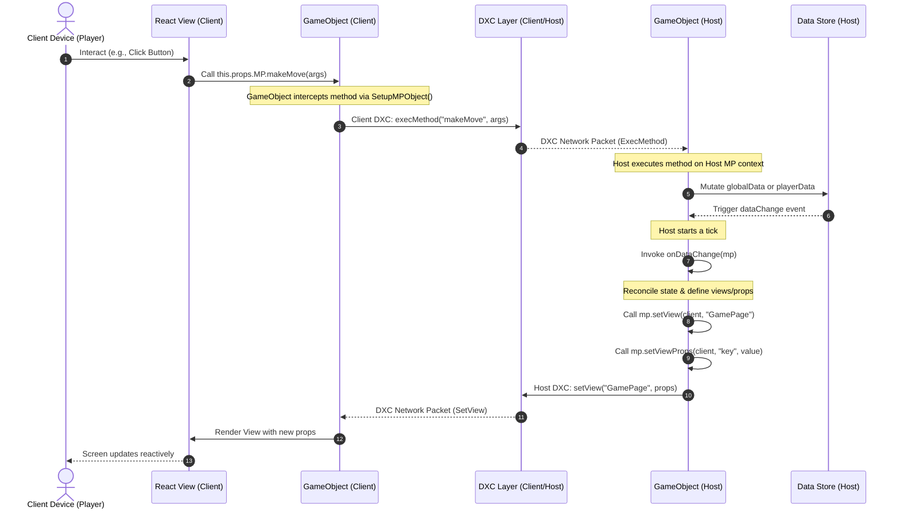
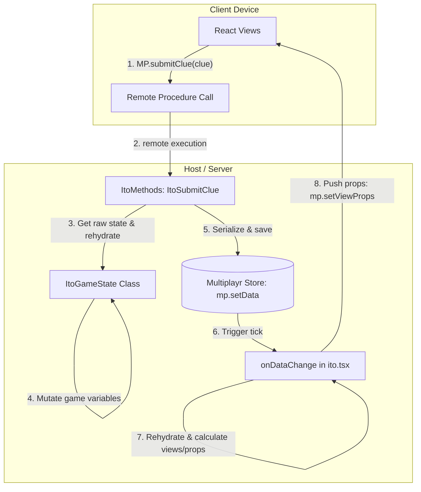

# Multiplayr Developer Guide & Agent Guidelines

This guide is designed to help human developers and AI agentic systems rapidly understand the architecture, core abstractions, composition patterns, and testing framework of Multiplayr. 

Whether you are debugging existing game loops or building brand-new games, these pages contain the precise diagrams and step-by-step code flows needed to work effectively in this repository.

---

## 1. The Action-Reconciliation Lifecycle

The most fundamental concept in Multiplayr is its **uni-directional, reactive data flow** across the client-server boundary. 

### Core Flow Sequence Diagram

This sequence diagram illustrates exactly what happens when a client performs an action (like playing a card or clicking a button):



### Flow Breakdown

1.  **View Binding**: All client-side React views receive the `mp` control object via `this.props.MP`.
2.  **Intercepted Method Remoting**: Methods declared on the game rule run *only* on the Host. On the client, the `SetupMPObject` wraps these functions in a remote procedure call wrapper (`clientMethodWrapper`). Invoking `this.props.MP.someMethod(...)` on a client automatically serializes the call and sends it over the DXC network layer to the Host.
3.  **Host Execution**: The Host receives the `ExecMethod` request, runs the registered method against the actual host `GameObject` state, and modifies the `DataStore`.
4.  **Host Tick & Reconciliation**: Modifying variables in the `DataStore` automatically schedules a "tick." During the tick, `onDataChange` is run on the Host.
5.  **View Distribution**: In `onDataChange`, the Host computes the appropriate views and props for each client ID, calling `mp.setView` and `mp.setViewProps`.
6.  **Push and Render**: These view configurations are pushed down over the DXC layer to the clients. The client-side engine receives the packet, passes the props into the React component, and reactively re-renders the DOM container.

---

## 2. Plugin Composition & Namespace Chaining

Multiplayr features a composition system where game rules can include plugins:
```typescript
export const BiggerRule: GameRuleInterface = {
    name: "bigger",
    plugins: {
        "lobby": LobbyPlugin
    },
    ...
}
```

### The Namespace Delimiter (`_`)

To prevent state collisions and enable modularity, all state variables and methods belonging to a plugin are dynamically namespaced using the underscore (`_`) delimiter. 
For instance, if rule `A` includes plugin `B`, and `B` includes plugin `C`:
- Variable `foo` in `B` is accessed from the parent rule `A` as: `mp.getData("B_foo")`
- Variable `bar` in `C` is accessed from the parent rule `A` as: `mp.getData("B_C_bar")`

### Recursive Namespace Routing

When you invoke a state access method (e.g. `getData`, `setData`, `getPlayerData`) or call a rule method on `mp`, the `GameObject` resolves the path recursively:

```typescript
function getFirstNamespace(variable: string) {
    const s = variable.split('_');
    if (s.length === 0) {
        return [null, variable];
    } else {
        const namespace = s[0];
        return [namespace, s.slice(1, s.length).join('_')];
    }
}
```

If the requested `variable` does not exist in the local `GameObject`'s store, the engine:
1. Splits the string by the first occurrence of `_` to isolate the `namespace` and the `rest`.
2. Inspects `this.plugins[namespace]`.
3. If it exists, delegates the call downwards: `this.plugins[namespace].getData(rest)`.

### View Props Delegation
When `onDataChange` finishes, the Host engine automatically nests the computed React props for all plugins and exposes them on the parent component's `props` object.
*   **Example**: If the `lobby` plugin calculates a list of names, the parent React view can access them directly via:
    ```javascript
    const playerNames = this.props.lobby.names;
    ```

---

## 3. The Decoupled GameState Architecture Pattern (Case Study: Ito)

To maintain clean code, high testability, and clear separation of concerns, all new game rules in Multiplayr must adhere to the **decoupled GameState/View/Method/GameRule architecture**. This pattern separates the core game engine from the network synchronization and UI layers.

This architecture consists of four distinct layers:
1. **Standalone GameState Class (`ItoGameState.ts`)**: The pure, frame-independent state machine containing all game variables, transition rules, and validation logic.
2. **React Views (`ItoViews.tsx`)**: Reactive presentation components that render UI based on props and trigger server methods on user interaction.
3. **Remote Methods (`ItoMethods.ts`)**: Server-side RPC entry points that receive client actions, rehydrate the GameState class, mutate it, and persist it back.
4. **Game Rule Definition (`ito.tsx`)**: The main Multiplayr wrapper that integrates plugins, manages global metadata, handles data change ticks, and distributes view props.



### 3.1 Standalone GameState Class (`ItoGameState.ts`)
The `ItoGameState` class is a pure TypeScript/JavaScript class. It has NO dependencies on React, Socket.io, or the Multiplayr core. 

Key design requirements:
- **Serialization & Rehydration**: Game session states in Multiplayr are saved as JSON strings inside the Host's database between ticks. This strips all prototype methods. The class must implement a serialization pattern using a raw data structure and a rehydration method:
  ```typescript
  export interface GameStateData {
      status: GameStatus;
      round: number;
      lives: number;
      players: { [playerId: string]: PlayerState };
      lockedPlayers: string[];
  }

  export class ItoGameState {
      private data: GameStateData;
      private readonly playerIds: string[];

      constructor(playerIds: string[]) {
          this.playerIds = [...playerIds];
          this.data = { ...initialState };
      }

      // Rehydrate the class from raw serialized JSON data
      public static from_data(data: GameStateData, playerIds: string[]): ItoGameState {
          const gameState = new ItoGameState(playerIds);
          gameState.data = { ...data };
          return gameState;
      }

      // Retrieve raw serializable data structure
      public get_data(): GameStateData {
          return { ...this.data };
      }
  }
  ```
- **Pure Game Logic**: All transitions, checks, and updates must reside in the GameState class as pure methods (e.g. `submit_clue`, `lock_clue`, `next_round`) that throw descriptive errors on invalid inputs or out-of-order moves.

### 3.2 Game Rule Definition (`ito.tsx`)
The game rule file serves as the coordinator. It defines composed plugins and orchestrates the database change tick (`onDataChange`).

```typescript
export const ItoRule: GameRuleInterface = {
    name: 'ito',
    hostAsPlayer: true,
    plugins: {
        'lobby': Lobby,
        'gameshell': Shell
    },
    globalData: {
        gameState: null, // Stores raw serialized GameStateData
    },
    onDataChange: (mp: MPType) => {
        const started = mp.getData('lobby_started');
        if (!started) {
            // Lobby/setup phase views
            mp.setView(mp.hostId, 'host-lobby');
            mp.playersForEach(c => mp.setView(c, 'client-lobby'));
            return true;
        }

        // Rehydrate GameState to perform operations
        let gameState = mp.getData('gameState');
        if (!gameState.get_player_data) {
            gameState = ItoGameState.from_data(gameState.data, gameState.playerIds);
            mp.setData('gameState', gameState);
        }

        // Extract and distribute props to client views
        mp.playersForEach((clientId) => {
            mp.setViewProps(clientId, 'clues', gameState.get_clues());
            mp.setViewProps(clientId, 'lives', gameState.get_lives());
            mp.setViewProps(clientId, 'secretNumber', gameState.get_player_data(clientId)?.secretNumber);
            mp.setView(clientId, 'mainpage');
        });

        return true;
    }
};
```

### 3.3 Remote Methods (`ItoMethods.ts`)
Methods are RPC hooks executed only on the Host. They should never write to `mp` variables directly; instead, they operate on the rehydrated `GameState` class and commit it back.

```typescript
export const ItoSubmitClue = (mp: MPType, clientId: string, clue: string) => {
    // 1. Fetch the raw data and rehydrate it
    let gameState = mp.getData('gameState');
    if (!gameState.get_player_data) {
        gameState = ItoGameState.from_data(gameState.data, gameState.playerIds);
    }

    // 2. Perform validation and transition
    gameState.submit_clue(clientId, clue);

    // 3. Serialize and save back to DB (which triggers onDataChange)
    mp.setData('gameState', gameState);
};
```

### 3.4 Composing with Lobby and Game Shell
All game rules must compose with the `lobby` and `gameshell` plugins to handle the game setup flow and responsive styling shells:
- **Lobby setup flow**: Clients connect, customize names/colors, and the host starts the game. The host starts the game by invoking `startGame` (e.g. `ItoStartGame`), which sets `lobby_started` to `true` and initializes `ItoGameState` with the active player IDs from the lobby.
- **Game Shell rendering**: In React views, wrap the game view inside `mp.getPluginView('gameshell', 'HostShell-Main', { links, gameName, topBarContent })`. This provides sidebar navigation links, settings pages, and standard top bar status values (like round indices or lives counts).

---

## 4. UI Player Reference Guidelines

When rendering player names, tags, or references in React views, developers must adhere to strict guidelines. **Raw Client ID string literals (like `"mp-client-xxxx"`) must NEVER be printed directly on the UI.**

Always use the standard plugins views:
- **Badge/Tag with Colors**: Use the `player-tag` plugin view. It prints a styled badge displaying the player's name and accent color:
  ```typescript
  const playerTag = MP.getPluginView('lobby', 'player-tag', { clientId: id });
  // Returns: React Element representing the badge
  ```
- **Plain Text Name**: Use the `player-name` plugin view. It prints the plain text name set in the lobby:
  ```typescript
  const playerName = MP.getPluginView('lobby', 'player-name', { clientId: id });
  // Returns: React Element representing plain text name
  ```
- **Fallback References**: In the event that player names/tags are not configured or available (e.g., custom local mode, or special roles), use:
  - Relative references: `"Player 1"`, `"Player 2"`.
  - Assigned role names: `"The Assassin"`, `"Guesser"`.

---

## 5. Mandatory Testing Methodologies

Writing robust tests is mandatory for all Multiplayr game rules. We split testing into two separate, mandatory layers: class-level logic tests and integration/simulation tests.

```mermaid
flowchart TD
    subgraph Unit Tests (Class-level)
        GameStateTest[test_ito.ts] -->|Direct Method Calls| Logic[ItoGameState Class]
        Logic -->|Assertions| GameStateTest
    end
    
    subgraph Integration Tests (Multiplayr-level)
        GameTest[couptest.ts] -->|invokeClientMethod| Multiplayr[GameRuleTest Instance]
        Multiplayr -->|Mutate state| Multiplayr
        GameTest -->|getClientData| Multiplayr
        Multiplayr -->|Assertions| GameTest
    end
```

### 5.1 Type A: Core Game Logic (Class-Level) Unit Tests
These tests target only the decoupled `GameState` class, without running the Multiplayr server infrastructure. They run synchronously, making them fast and simple to debug.

- **Objective**: Verify that state machine rules, validation limits, scores, and win/loss states work as expected.
- **Mocking**: Instantiating custom boards or secret numbers is done by manually modifying the retrieved raw state structure, then re-rehydrating the class.
- **Example Pattern (Minesweeper & Ito)**:
  ```typescript
  describe('Ito Game State Logic', () => {
      it('should lose lives when numbers are locked in wrong order', () => {
          const game = new GameState(['alice', 'bob']);
          game.start_game();

          // Mock numbers directly on the state data
          const data = game.get_data();
          data.players['alice'].secretNumber = 90; // Higher number
          data.players['bob'].secretNumber = 10;   // Lower number

          const mockedGame = GameState.from_data(data, ['alice', 'bob']);
          
          mockedGame.submit_clue('alice', 'clueA');
          mockedGame.lock_clue('alice'); // Locks 90 first

          mockedGame.submit_clue('bob', 'clueB');
          mockedGame.lock_clue('bob'); // Locks 10 second -> Out of order!

          assert.strictEqual(mockedGame.get_lives(), 2, 'Should have lost a life');
      });
  });
  ```

### 5.2 Type B: Integration / Simulation (Multiplayr-Level) Tests
These tests run inside `GameRuleTest`, simulating the real Multiplayr architecture: it spins up an in-memory server and multiple local client instances linked via local transports.

- **Objective**: Ensure that client methods remote successfully to the host, `onDataChange` correctly distributes views and props, and data mutations persist across database ticks.
- **Mocks**: Injecting specific game situations is done using `setState(mockStateJsonString)` directly on the `GameRuleTest` instance.
- **Verification Primitives**:
  - `invokeClientMethod(playerIndex, methodName, ...args)`: Simulates a player submitting an action from a React view.
  - `invokeHostMethod(methodName, ...args)`: Simulates host actions.
  - `getClientData(playerIndex, variable)` / `getHostData(variable)`: Query raw values in the database.
- **Example Pattern (Coup)**:
  ```typescript
  describe('Coup Assassin Integration Test', () => {
      it('should reduce gold and assassinate target card', () => {
          const couptest = new GameRuleTest('coup', 3);
          couptest.setState(basicStateJson); // Inject mock mid-game board state

          const targetClientId = couptest.getPlayerClientId(1);

          // Simulate Player 0 executing the "assassinate" client action targeting Player 1
          couptest.invokeClientMethod(0, 'takeAction', CoupAction.Assassin, targetClientId);
          
          // Simulate Host ending the challenge timer
          couptest.invokeHostMethod('endChallengePhase');

          // Simulate Player 1 revealing card index 1
          couptest.invokeClientMethod(1, 'revealCard', '1');

          // Assert database modifications
          assert.strictEqual(couptest.getClientData(0, 'coins'), 1, 'Player 0 spent 3 coins');
          const targetCards = couptest.getClientData(1, 'cards');
          assert.strictEqual(targetCards[1].state, CoupCardState.Assassinated);
      });
  });
  ```

### 5.3 Mandatory Test Requirements
Every new game rule added to the repository must submit **both** Type A and Type B test files. A pull request without logic-level unit tests and end-to-end integration tests will be rejected.

---

## 6. Agent Guidelines

If you are an AI assistant tasked with modifying or extending Multiplayr, follow these strict coding guidelines to ensure perfect compatibility:

> [!WARNING]
> **Host-Only State Mutability**: NEVER attempt to store game state variables directly inside a React component's `this.state` or on the client-side `GameObject` instance. The Host is the *only* device that executes game methods and writes to the `DataStore`. Clients must remain entirely state-free and driven strictly by views and props pushed down by the Host.

*   **Read the Design & Style Language Guide**: You MUST review and strictly adhere to all guidelines in [DESIGN_GUIDE.md](file:///c:/repos/multiplayr/docs/DESIGN_GUIDE.md) before writing styling rules, designing view layouts, or outputting templates.
*   **Plugin Prefix Safety**: When adding a new composed rule or plugin, verify that you are prefixing any plugin variables appropriately (e.g. `mp.setData('lobby_name', val)` instead of `mp.setData('name', val)`).
*   **Method Signatures**: All custom methods inside `methods` MUST have `mp: MPType` as their first parameter, and `clientId: string` as their second parameter:
    ```typescript
    methods: {
        myMethod: (mp: MPType, clientId: string, arg1: any) => { ... }
    }
    ```
*   **Run compile check**: After making changes, always run `npm run buildDev` and `npm test` to ensure that standard types compile correctly and that the automated test suite continues to pass.
